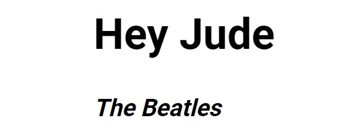

<p align="center">
<a href="https://grzegorz-jodlowski.github.io/git-learning-2/"></a>
</p>


# <p align="center">🎵 GIT learning</p>
<p align="center">Simple project for learning GIT (version control system)</p>

</br>

## Table of Contents

- [What's this project about?](#about)
- [Technologies used](#technologies)
- [What I learned?](#what)
- [Interesting code snippet](#interesting)
- [GitHub Pages](#gitHub)

</br>

## <a name="about"></a>What's this project about?

 This

</br>

## <a name="technologies"></a>Technologies used
- HTML
- CSS
- GIT

</br>

## <a name="what"></a>What I learned?
- c


</br>

## <a name="interesting"></a>Interesting code snippet (for me of course 😉)
- c

```css

}
```


</br>

## <a name="gitHub"></a>GitHub Pages
<a href="https://grzegorz-jodlowski.github.io/git-learning-2/">GIT learning</a>


