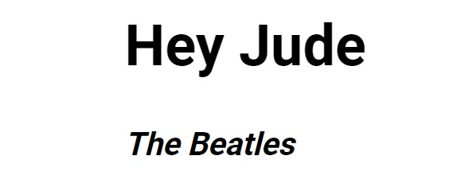

<p align="center">
<a href="https://grzegorz-jodlowski.github.io/git-learning-2/"></a>
</p>


# <p align="center">🎵 GIT learning</p>
<p align="center">Simple project for learning GIT</p>

</br>

## Table of Contents

- [What's this project about?](#about)
- [Technologies used](#tech)
- [What I learned?](#what)
- [Interesting code snippet](#interesting)
- [Website (on GitHub Pages)](#site)

</br>

## <a name="about"></a>What's this project about?

 This is simple old-fashioned page created only for learning GIT. It contains the text of the iconic song Hey Jude.


</br>

## <a name="tech"></a>Technologies used
- HTML
- CSS
- npm
- GIT

</br>

## <a name="what"></a>What I learned?
- benefits of using version control system,
- what are the principles of GIT,
- use GIT in the terminal and in the VC code editor,
- adjust GIT to my own preferences,
- initialize repositories in various ways (from local level and from a remote repository),
- use a .gitignore file,
- name commits correctly,
- properly interact with the remote repository,
- set up GitHub repositories and authenticate with the SSH key,
- resolve conflicts between versions in the remote and local repository,
- work with branches and merge them together,

</br>

## <a name="interesting"></a>Interesting code snippet (for me of course 😉)
- delete a file only from a Git repository (not remove it from the local filesystem)

```git
git rm --cached example.txt
git commit -m "Remove example.txt"
git push origin branch_name
```
- last commite modification (for example, to add or change a comment)

```git
git commit --amend -m "..."
```

</br>

## <a name="site"></a>Website (on GitHub Pages)
<a href="https://grzegorz-jodlowski.github.io/git-learning-2/">GIT learning</a>

</br>
</br>

  *project implemented as part of the 9-month [Web Developer Plus](https://kodilla.com/pl/bootcamp/webdeveloper/?type=wdp&editionId=309) course organized by [Kodilla](https://drive.google.com/file/d/1AZGDMtjhsHbrtXhRSIlRKKc3RCxQk6YY/view?usp=sharing)